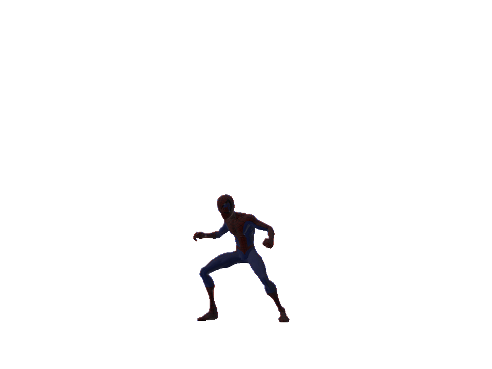
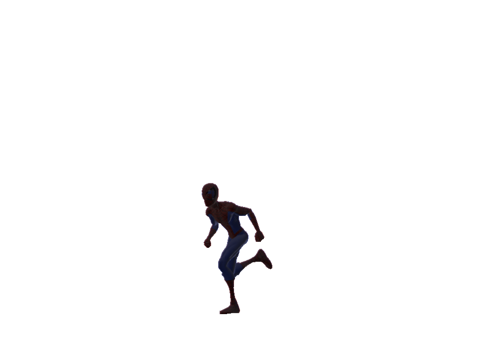

# pcmesh-blender

Currently only supports importing models and the standard textures supported internally by Blender for DDS etc. Textures are expected to be found in the same location as models that use them. 

Characters and other mesh types are currently WIP. 

## Usage

Extract to `scripts/addons/pcmesh`.

## Contributors

LemonHaze - code, reversing, documentation

## Special Thanks

noop
